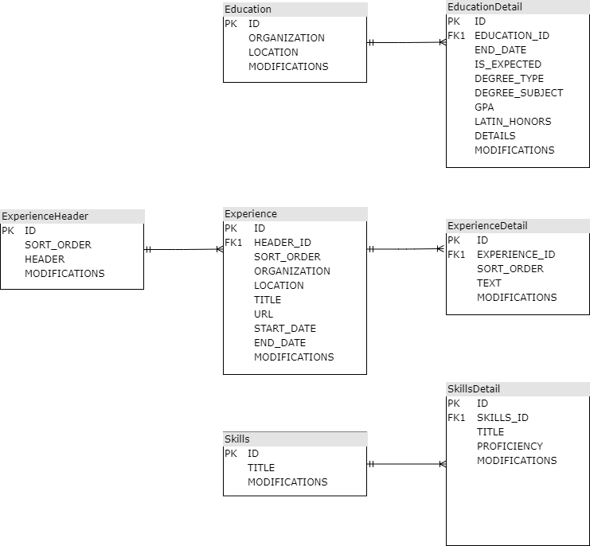

## Overview

When applying to jobs, it's often advantageous to customize your resume for the company and/or position to which you're applying. Frustration from not being able to easily include or exclude components of my resume lead to this (simple) resume builder.

The styling is quite static right now. However, it is modular, so with a little bit of HTML and CSS knowledge, modification to ``/WebContent/views/*`` and ``/WebContent/styles/Resume.css`` will go a long way. 

 

## Installation

First thing is first. When cloning to your local machine, the latest SQLite JDBC jar file, ``sqlite-jdbc-*.jar``, is included in ``WEB-INF/lib/`` of the project. You may wish to update it.
In order to access your database, you must update SQLite.java with the correct URL to your SQLite database CV.db.
When SQLite.java is run, it will be run from your local server (e.g. Apache), which has a specific workspace. It may be easiest to hard-code an absolute URL from your root directory. 

 

 

## Usage

Now for the good stuff! When CV.db is populated (via a third-party application), you can boot up and start building the right resume for the job. Or select all for your curriculum vitae.

 

 

Just choose what you would like and click submit. It will show up appropriately on the next page. Keep in mind that the margin is set to 0 on the body of the page, and the resume is not centered to account for exporting as PDF so that the dimensions are correct. Save as PDF has been used consistently and successfully on Google Chrome without any necessary modification.

 

 

## Entering your own Information

For more information on how to populate the CV.db database, see the ER diagram below.

 

